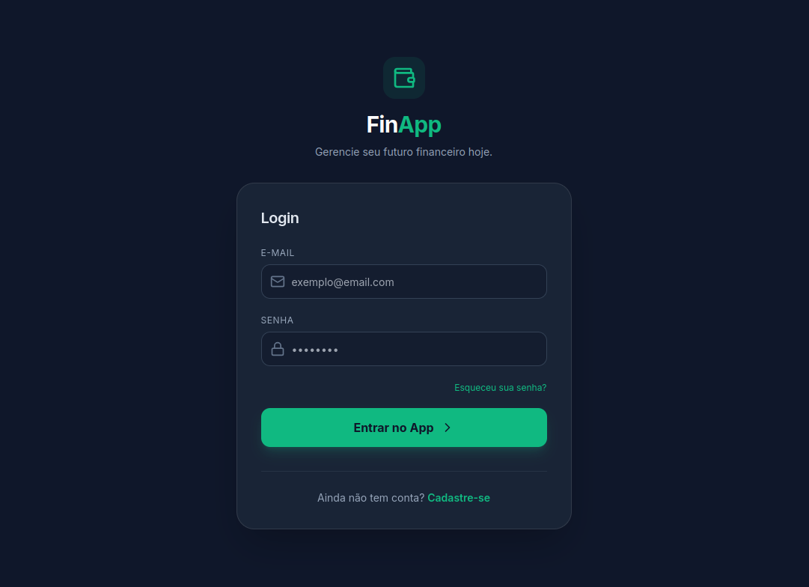
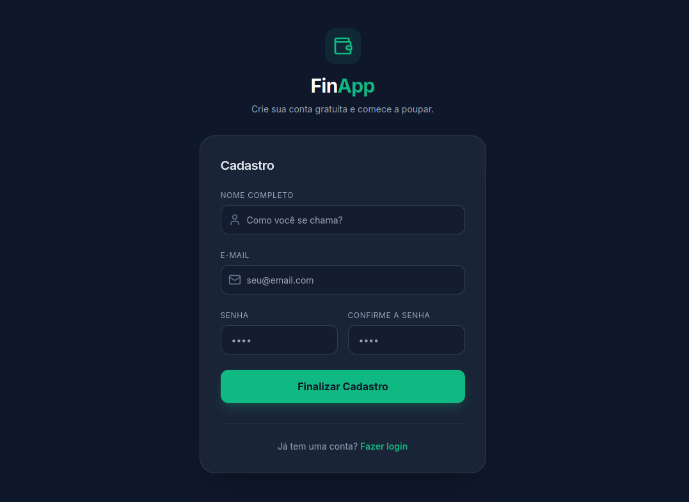
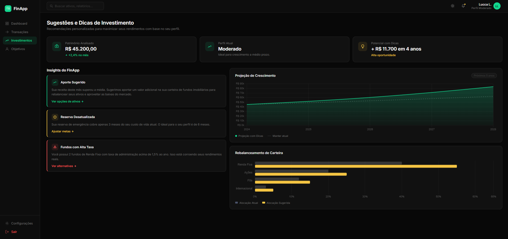

# Projeto de Interface

Visão geral da interação do usuário pelas telas do sistema e protótipo interativo das telas com as funcionalidades que fazem parte do sistema (wireframes).

 Apresente as principais interfaces da plataforma. Discuta como ela foi elaborada de forma a atender os requisitos funcionais, não funcionais e histórias de usuário abordados nas <a href="2-Especificação do Projeto.md"> Documentação de Especificação</a>.

## User Flow

## Wireframes

### Login e Cadastro

Nesta tela, são apresentados os requisitos funcionais RF-01 (Cadastro) e RF-02 (Login), permitindo que o usuário acesse sua conta existente ou crie uma nova de forma rápida. A navegação entre as seções é feita por meio de uma transição fluida, onde o formulário de login solicita e-mail e senha, enquanto a seção de cadastro inclui campos para nome completo e confirmação de senha. Toda a interface foi projetada com ícones intuitivos e botões de ação destacados em verde esmeralda, assegurando a conformidade com o requisito de interface prática e responsiva.

### Tela Pricipal (Dashboard)

Esta tela principal é o centro de controle financeiro do usuário. O design em dark mode adota uma hierarquia visual clara, usando a cor verde para destacar dados críticos e ações.
* Minhas Finanças: Mostra o saldo atual e um snapshot rápido de receitas e despesas totais.
* Metas: Usa barras de progresso horizontais e ícones para rastrear objetivos de longo prazo (ex: viagem, casa) de forma motivadora.
* Gráfico de Despesas: Analisa gastos por categoria (ex: moradia, transporte) usando barras empilhadas e filtros de tempo (últimos 3/6 meses).
* Fluxo de Caixa: Exibe a tendência anual de receitas vs despesas em um gráfico de área.
* Ações Rápidas: Botões proeminentes na parte inferior para adicionar novas transações instantaneamente.

### Sugestões e Dicas

A tela apresenta o módulo de Investimentos do sistema, focado em oferecer recomendações personalizadas de controle financeiro e otimização de investimentos com base no perfil e nos dados do usuário.\
O sistema exibe um resumo consolidado da situação financeira: Na seção de insights, o sistema analisa os hábitos financeiros (gastos, aportes e metas) e gera orientações práticas. A tela também apresenta uma projeção de crescimento patrimonial, comparando dois cenários: manter a estratégia atual ou seguir as recomendações. O gráfico evidencia que, ao aplicar as sugestões, o crescimento tende a ser significativamente maior ao longo dos próximos anos. Por fim, há uma análise de rebalanceamento de carteira, que compara a alocação atual dos investimentos com uma alocação sugerida. Observa-se uma recomendação de ajuste na distribuição entre renda fixa, ações, fundos imobiliários e ativos internacionais, buscando maior diversificação e melhor equilíbrio entre risco e retorno.

> **Links Úteis**:
> - [Protótipos vs Wireframes](https://www.nngroup.com/videos/prototypes-vs-wireframes-ux-projects/)
> - [Ferramentas de Wireframes](https://rockcontent.com/blog/wireframes/)
> - [MarvelApp](https://marvelapp.com/developers/documentation/tutorials/)
> - [Figma](https://www.figma.com/)
> - [Adobe XD](https://www.adobe.com/br/products/xd.html#scroll)
> - [Axure](https://www.axure.com/edu) (Licença Educacional)
> - [InvisionApp](https://www.invisionapp.com/) (Licença Educacional)

### Tela de Configurações

A tela de Configurações do FinApp é dividida em quatro partes principais para facilitar o uso. No topo, há uma área para editar o perfil do usuário (nome e e-mail) e um painel de personalização para ativar o modo escuro, sons e notificações. Na parte de baixo, o usuário consegue gerenciar tags e categorias, permitindo criar ou excluir nomes como "Alimentação", "Lazer" e "Investimentos" para organizar melhor suas contas.

